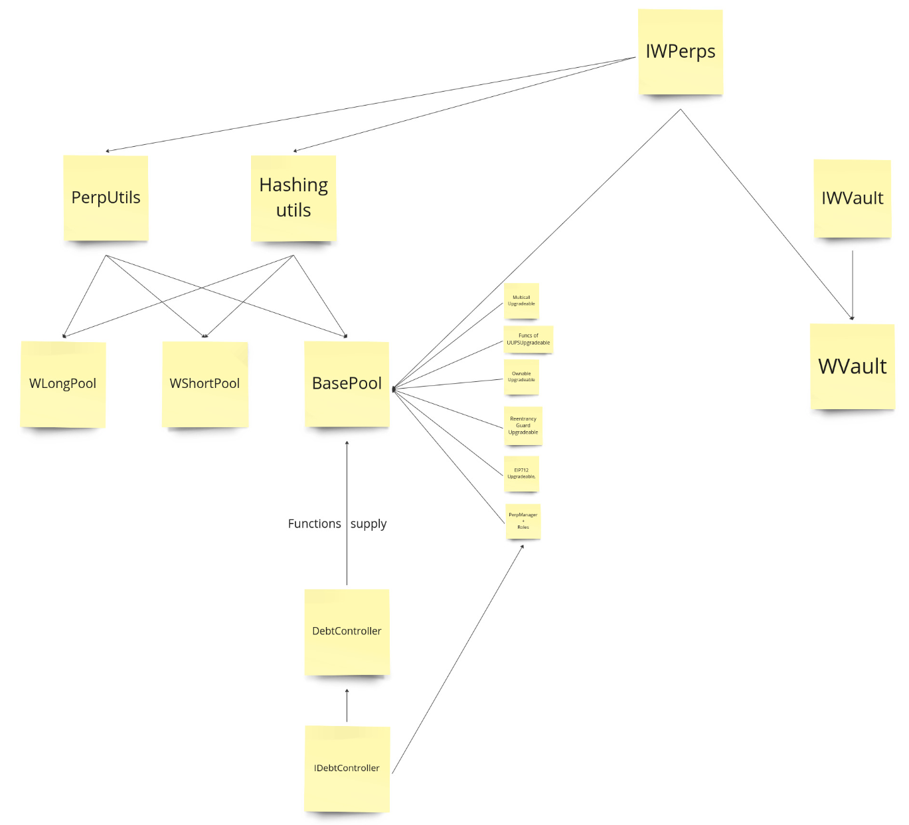

# Wasabi Perps Solana
* wasabi_perps implementation on solana

### The smart contracts that need to be implemented
-----
#### `Wasabi Vault`
* An upgradeable ERC-4626-compliant vault that interfaces with a WasabiPerps pool, leveraging the ERC-4626 standard as its foundational logic.
  * Consequently, the ERC-4626 contract will be implemented.
* The contract also features functions for interacting with the associated WasabiPerps pool and includes an address provider to manage external contract addresses.

#### `WasabiShortPool` and `WasabiLongPool`
* implementation of a short/long position pool in the Wasabi protocol. They extend the `BaseWasabiPool` contract and provide functionality for **opening**, **closing**, **liquidating**, and **claiming** **short/long positions**. The contracts handle the logic for **swapping tokens**, **managing collateral**, **calculating interest and fees**, and interacting with external contracts like WETH and vaults. They include security measures such as signature validation, reentrancy protection, and role-based access control for certain functions.

#### `BaseWasabiPool` contract
* An abstract base contract for both Wasabi long and short pools. It manages vaults, positions, and base tokens, and provides functions for **withdrawing assets**, **donating tokens**, and **adding vaults**. The contract includes role-based access control, upgradability features, and **implements the EIP712 standard** for secure signature verification. It also handles **interest calculations**, **repayment recording**, and **fee distributions**. The contract interacts with external components like the **address provider** and **debt controller**, and includes internal utility functions for various pool operations.

#### Important Notes:
- Both `wasabi_vault`, `WasabiShortPool`, `WasabiLongPool` and `BaseWasabiPool` inherit the `UUPSUpgradeable` smart contract and since openzeppelin provide the upgradability mechanism out of the box, we will have to implement the few functions on our own.

- `BaseWasabiPool` inherits from the `MulticallUpgradeable` standard contract. Since the `WasabiLongPool_validations.test` and `WasabiLongPool_tradeFlow.test` tests utilize the `multicall` function, we need to implement this contract.

- Additionally, the locations of functions from `PerpUtils`, `Hash`, and the `IWasabiPerps` interface are implementation details that will be addressed during development, and thus will be incorporated into the development process i.e. they will be included but if they will be standalone contracts or part of some other monolith contract will be a subject of discussion.

#### `DebtController`
- The DebtController contract manages debt-related parameters such as **maximum APY**, **leverage**, and **liquidation threshold**, and provides functions to compute **maximum interest** and **principal** based on these parameters.

#### Accounts logic
* AddressProvider, PerpManager & Roles are helper contracts that can be combined in a monolith contract or kept as standalone contracts. It can be further discussed.

